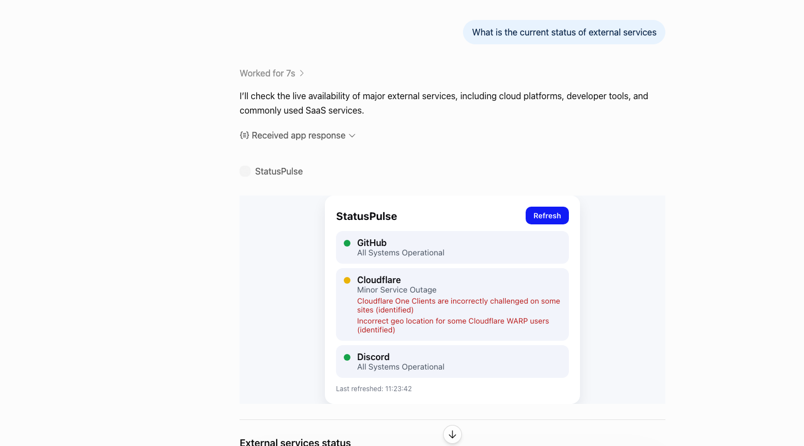

# StatusPulse

An MCP server that shows live status of popular online services as a small dashboard widget inside ChatGPT.

Ask ChatGPT "Is GitHub down?" and it calls the `get_status` tool, then renders a card for each service with a coloured status dot and a Refresh button. No API keys needed, it only reads public status pages.

Built as a learning project for the MCP Apps UI standard.

## Snapshot

<!-- Replace the file below with your own screenshot or GIF. Suggested path: docs/snapshot.png -->



> Tip: capture the chat showing your question and the widget together. A short GIF that includes the Refresh click works even better (save as `docs/demo.gif` and link it here).

## Features

- One tool, `get_status`, that checks 13 services (or any list of them you pass)
- Live widget with green, yellow, orange, red and grey status dots, problems sorted first, and an "All / Issues only" filter
- Click a card to expand it: affected components, latest incident updates, a per-service "Check again" and a link to the official status page
- Failure-tolerant: if one status page is unreachable, that card shows "Unknown" and the rest still load
- Single small server file plus one HTML file, no build step

## How it works

1. You ask a question in ChatGPT.
2. ChatGPT calls the `get_status` tool on your server at `/mcp`.
3. The server fetches each service's public status JSON and returns structured data.
4. ChatGPT loads the widget (`public/status-widget.html`) in a sandboxed frame and passes it the data.
5. Clicking Refresh makes the widget call the tool again through the host.

## Prerequisites

- Node.js 20 or newer (`node -v`)
- A tunnel to expose your local server over HTTPS, for example [ngrok](https://ngrok.com) (`brew install ngrok`, then `ngrok config add-authtoken <token>`)
- A ChatGPT account with Developer mode available (availability can depend on account or workspace policy)

## Quick start

```bash
git clone https://github.com/<your-username>/statuspulse-mcp.git
cd statuspulse-mcp
npm install
node server.js
```

You should see:

```
StatusPulse MCP server listening on http://localhost:8787/mcp
```

Check it is alive:

```bash
curl -s http://localhost:8787/
# StatusPulse MCP server
```

## Test locally with MCP Inspector

```bash
npx @modelcontextprotocol/inspector@latest
```

1. Choose **Streamable HTTP**
2. Enter `http://localhost:8787/mcp` and click **Connect**
3. Open **Tools**, click **List Tools**, select `get_status`, then **Run Tool**

The Inspector shows the returned data. The widget itself only renders inside ChatGPT.

## Connect to ChatGPT

1. Expose the server (keep `node server.js` running in another terminal):
   ```bash
   ngrok http 8787
   ```
2. Copy the `https://...` address and add `/mcp`, for example `https://<subdomain>.ngrok-free.app/mcp`
3. In ChatGPT, open **Settings → Security and login** and turn on **Developer mode**
4. Go to [chatgpt.com/plugins](https://chatgpt.com/plugins), press the plus button, and enter:
   - Name: `StatusPulse`
   - Description: `Check if popular online services (GitHub, Cloudflare, Discord) are up or down, and see a live status dashboard right in the chat.`
   - Connection: your MCP URL ending in `/mcp`
5. Create the connection and confirm the `get_status` tool is listed
6. Start a **new chat**, click **+ → More**, and select **StatusPulse**

Menu names have changed between ChatGPT releases, so look for "Developer mode" and "add MCP server by URL" if yours differ.

## Usage

Try prompts like:

- "Is GitHub down right now?"
- "Check all services."
- "Is Cloudflare having any incidents?"

Available service ids: `github`, `cloudflare`, `discord`, `openai`, `claude`, `npm`, `vercel`, `netlify`, `digitalocean`, `twilio`, `atlassian`, `figma`, `linear`.

## Project structure

```
statuspulse-mcp/
├── package.json              # dependencies, "type": "module"
├── server.js                 # MCP server: tool, widget resource, HTTP endpoint
├── public/
│   └── status-widget.html    # the widget rendered inside ChatGPT
└── docs/
    └── snapshot.png          # your screenshot (add it)
```

## Configuration

| Setting | Default | Notes |
|---|---|---|
| `PORT` | `8787` | Run `PORT=9000 node server.js` to change it. Remember to point ngrok at the same port. |

## Add another service

Any status page that uses the common `/api/v2/summary.json` format works. Add one line to `SERVICES` in `server.js`:

```js
const SERVICES = {
  github: { name: 'GitHub', url: 'https://www.githubstatus.com/api/v2/summary.json' },
  // add yours:
  myservice: { name: 'My Service', url: 'https://status.example.com/api/v2/summary.json' },
};
```

Then update the tool description so ChatGPT knows the new id, restart the server, and press **Refresh** on the plugin page.

## Updating after changes

After changing tool names, descriptions, schemas or the widget:

1. Restart `node server.js`
2. Open your connection at [chatgpt.com/plugins](https://chatgpt.com/plugins) and press **Refresh**
3. Start a new chat and test again

If ngrok restarted, its address changed, so update the URL in the plugin too.

## Troubleshooting

| Problem | What to check |
|---|---|
| Server crashes on start with a file-not-found error | Run from the project folder and make sure `public/status-widget.html` exists |
| `Cannot use import statement` | Run `npm pkg set type=module` |
| Inspector cannot connect | Server running? Transport set to Streamable HTTP? URL ends with `/mcp`? |
| ChatGPT cannot connect | ngrok running? URL is https and ends with `/mcp`? `curl https://<your-ngrok>/` prints `StatusPulse MCP server`? |
| Plugin not visible in chat | Use a new chat, then **+ → More**. Check the plugin page for an install or refresh option and that Developer mode is on |
| Text but no widget | Tool `_meta.ui.resourceUri` must match the registered resource (`ui://widget/status.html`) and the result must include `structuredContent` |
| Widget stuck on "Waiting for data…" | Check the browser console for errors and confirm data is at `structuredContent.services` |
| A service shows Unknown | Its status page was unreachable or its URL changed. Test it with `curl` |

## Roadmap

- [ ] 30-second cache to avoid refetching on every question
- [ ] AWS, Azure and Google Cloud feeds (different formats, normalised to one shape)
- [x] Click-to-expand cards
- [ ] `get_incident_details` tool
- [ ] Deploy to a small host so ngrok isn't needed
- [ ] Dark mode

## Learn more

- [OpenAI MCP server and UI quickstart](https://developers.openai.com/plugins/build/app-quickstart)
- [Add UI to your MCP server](https://developers.openai.com/plugins/build/chatgpt-ui)
- [Connect and test your plugin](https://developers.openai.com/plugins/deploy/connect-chatgpt)
- [MCP Inspector](https://modelcontextprotocol.io/docs/tools/inspector)
- [Official examples](https://github.com/openai/openai-apps-sdk-examples)

## License

MIT. Add a `LICENSE` file before publishing (`<year> <your name>`).
